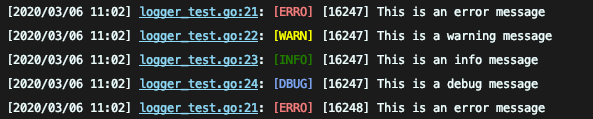

# logger
一个简单的日志库

```go
package main
import (
    "github.com/qnsoft/logger"
    "io"
    "os"
)

func main (){
    // 设置日志级别
    logger.SetLogLevel(logger.DebugLevel)
    // 设置输出对象
    logger.SetOutput(io.MultiWriter(os.Stdout, os.Stderr))
    
    // 是否显示调用文件名, 默认开启
    logger.SetReportCaller(true)
    
    // 设置默认日志时间格式 为空不显示
    logger.SetDateFormat("")

    // 使用默认日志对象打印
    logger.Error("This is an error message")
    logger.Warning("This is a warning message")
    logger.Print("This is an info message")
    logger.Debug("This is a debug message")
    
    
    newLogger := logger.New()
    // 默认为标准输出
    newLogger.SetOutput(os.Stdout)
    // 替换默认的日志对象 非必须操作, 如果你比较喜欢这种方式
    logger.SetDefault(newLogger)
    newLogger.Print("this is newLogger info message")
    logger.Print("This is an info message")
}
```

# 输出样式如下 #


# 取消色彩 #
```go
logger.DisableColor = true
```
使用 `DisableColor`禁用色彩, 建议测试期间开启, 生产关闭, 不然输出格式会错乱